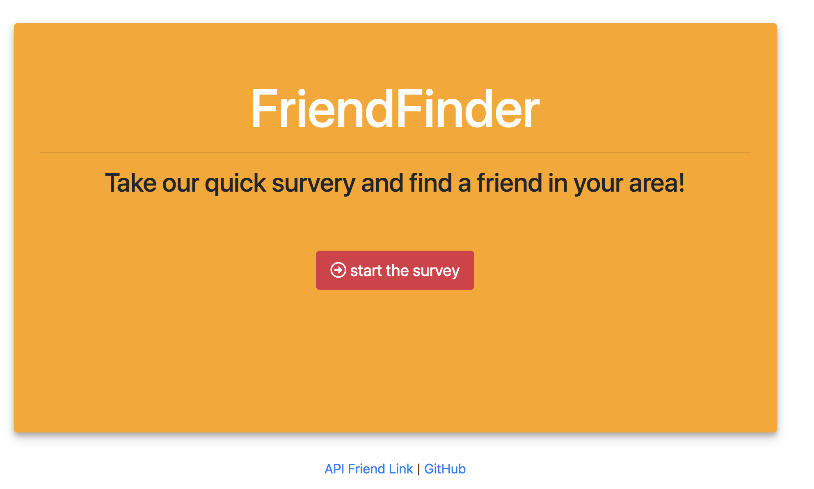

# FriendFinder

# Full-Stack Web App

App hosted by Heroku: https://enigmatic-wave-14167.herokuapp.com/

<br>
This is a full-stack, compatibility-based "FriendFinder" application. The site will take in results from the users' survery and then compare their answers with those of other users. The app will display the name and picture of the user with the best overall match. Fill out the survery and see who would be your friend match!
<br><br>



<br>
#Run Locally
<br>
To run the application locally and access it in your browser, first set the PORT environment variable to the value of your choice. An example is shown below.

```
const PORT = process.env.PORT || 8080;
```
<br>
After the PORT environment has been set, run the Node.js application in the command line:

```
node server.js
```
<br>
The application will now be running locally on PORT, in this case that is port 8080. You can then access it locally from your browser at the URL localhost:PORT, in this case localhost:8080.


